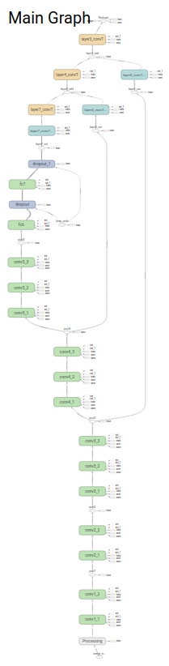
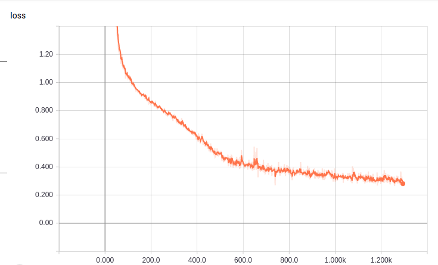
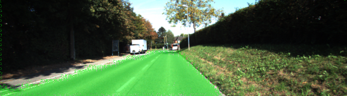

# CarND Semantic Segmentation
Self-Driving Car Engineer Nanaodegree Program

## Overview
This repository contains the code needed to complete the Semantic Segmentation project for Udacity's Self-Driving Car Nanodegree. In this project, road in images are labeled using a Fully Convolutional Network (FCN).

## Dependencies
##### Frameworks and Packages
Make sure you have the following is installed:
 - [Python 3](https://www.python.org/)
 - [TensorFlow](https://www.tensorflow.org/)
 - [NumPy](http://www.numpy.org/)
 - [SciPy](https://www.scipy.org/)
##### Dataset
Download the [Kitti Road dataset](http://www.cvlibs.net/datasets/kitti/eval_road.php) from [here](http://www.cvlibs.net/download.php?file=data_road.zip).  Extract the dataset in the `data` folder.  This will create the folder `data_road` with all the training a test images.

## Project Details
This project implements the [Fully Convolutional Networks for Semantic Segmentation](https://people.eecs.berkeley.edu/~jonlong/long_shelhamer_fcn.pdf) in TensorFlow. 

In main.py, hyperparameter tuning attempts to minimize cross entropy.

The trained network is then used to segment the road in images from the Kitti dataset.

 